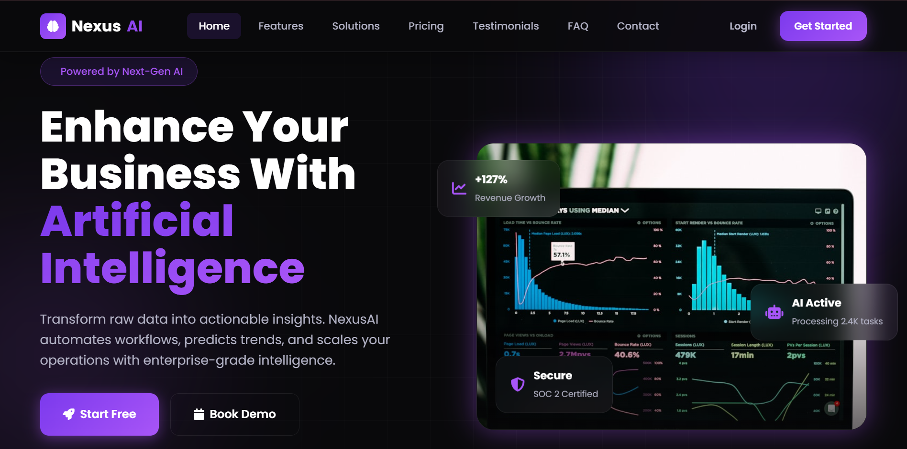

# NexusAI — Premium AI SaaS Landing Page

A modern, responsive landing page for an AI-powered business intelligence platform. Built with pure HTML, CSS, and Vanilla JavaScript — no frameworks.



## Features

- **Premium Dark UI** — Glassmorphism, neon purple glow, and smooth gradients
- **Fully Responsive** — Optimized for desktop, laptop, tablet, and mobile
- **Interactive Components** — Mobile menu, FAQ accordion, scroll reveal animations
- **Smooth UX** — Sticky navbar, active nav links, smooth scrolling, back-to-top button
- **Semantic HTML** — Accessible, well-structured markup with section comments
- **Production-Ready** — Clean code, CSS variables, organized sections, reusable classes

## Technologies Used

| Technology | Purpose |
|---|---|
| HTML5 | Semantic structure |
| CSS3 | Styling, animations, responsive design |
| Vanilla JavaScript | Interactivity |
| Google Fonts (Poppins) | Typography |
| Font Awesome 6 | Icons |
| Unsplash | Placeholder images |

## Folder Structure


## How to Run

1. Clone or download this repository
2. Open the project folder
3. Open `index.html` in any modern web browser

No build step, no dependencies, no server required.

**Optional — Live Server:**
```bash
# Using VS Code Live Server extension
# Right-click index.html → "Open with Live Server"

# Or using Python
python -m http.server 8000
# Visit http://localhost:8000

Live Demo
🔗 View Live Demo : comming soon

Sections
Sticky Navbar with mobile hamburger menu
Hero with floating cards and dashboard mockup
Trust / company logos
6 Feature cards with hover effects
How It Works — 3-step timeline
AI Dashboard preview with chart widgets
3-tier Pricing (Starter, Pro, Enterprise)
3 Testimonial cards
FAQ accordion (6 questions)
Call-to-action section
Footer with links and social icons
## Author
**Arooj Mehmood**
Frontend Developer | BS Computer Science Student
NeuroFive Solutions Internship Assignment

Built with ❤️ using HTML, CSS, and JavaScript.

---

## Quick start

1. Create the folder `AI-SaaS-Landing-Page` on your Desktop.
2. Add the four files above (`index.html`, `style.css`, `script.js`, `README.md`).
3. Open `index.html` in Chrome, Edge, or Firefox.

---

## What's included

| Requirement | Status |
|---|---|
| Semantic HTML + section comments | ✅ |
| CSS variables + organized sections | ✅ |
| Dark purple glassmorphism theme | ✅ |
| Poppins + Font Awesome CDN | ✅ |
| All 11 sections | ✅ |
| Responsive (desktop → mobile) | ✅ |
| Sticky navbar, mobile menu, accordion | ✅ |
| Scroll reveal, smooth scroll, back-to-top | ✅ |
| Unsplash images (no local images) | ✅ |
| Professional README | ✅ |

---
